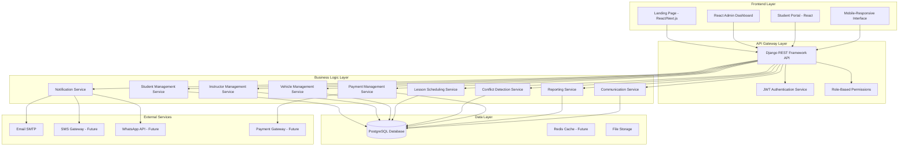

# Design Document

## Overview

The Driving School Management System is designed as a modern web application using Django REST Framework backend with PostgreSQL database, React-based frontend components, and comprehensive notification systems. The architecture builds upon the existing Django backend while implementing modern best practices, proper authentication, role-based access control, and advanced scheduling capabilities.

The system supports the complete driving school ecosystem: student lifecycle management from registration to graduation, instructor and vehicle resource allocation, flexible lesson scheduling with conflict resolution, comprehensive payment tracking, multi-channel communication, and student self-service portals.

## Architecture

### System Architecture



### Technology Stack

**Backend:**
- Django 5.x with Django REST Framework
- PostgreSQL 14+ for primary data storage
- JWT authentication using djangorestframework-simplejwt
- Celery for asynchronous task processing
- Redis for caching and task queue
- drf-spectacular for API documentation
- Docker containerization

**Frontend:**
- React Admin for administrative interface
- React/Next.js for public landing page and student portal
- react-i18next for internationalization
- Axios for API communication
- Material-UI or similar for consistent design

**Infrastructure:**
- Docker Compose for development environment
- PostgreSQL container for database
- Redis container for caching and queues
- Environment-based configuration management

## Components and Interfaces

### Enhanced Data Models

Building upon the existing models with significant enhancements:

#### User Management Models

```python
# Custom User Model (extends AbstractUser)
class CustomUser(AbstractUser):
    class Role(models.TextChoices):
        ADMIN = 'admin', 'Administrator'
        DIRECTOR = 'director', 'Director'
        INSTRUCTOR = 'instructor', 'Instructor'
        RECEPTION = 'reception', 'Reception'
    
    role = models.CharField(max_length=20, choices=Role.choices)
    phone_number = models.CharField(max_length=20, blank=True)
    is_active = models.BooleanField(default=True)
    created_at = models.DateTimeField(auto_now_add=True)
    updated_at = models.DateTimeField(auto_now=True)

# Instructor Profile (OneToOne with User)
class InstructorProfile(models.Model):
    user = models.OneToOneField(CustomUser, on_delete=models.CASCADE, related_name='instructor_profile')
    hire_date = models.DateField()
    license_categories = models.JSONField(default=list)  # Store as list of categories
    active = models.BooleanField(default=True)
    specializations = models.TextField(blank=True)
    created_at = models.DateTimeField(auto_now_add=True)
    updated_at = models.DateTimeField(auto_now=True)
```

#### Enhanced Student Model

```python
class Student(models.Model):
    class Status(models.TextChoices):
        PENDING = 'pending', 'Pending'
        ACTIVE = 'active', 'Active'
        INACTIVE = 'inactive', 'Inactive'
        GRADUATED = 'graduated', 'Graduated'
        DROPPED = 'dropped', 'Dropped'
    
    first_name = models.CharField(max_length=50)
    last_name = models.CharField(max_length=50)
    email = models.EmailField(unique=True)
    phone_number = models.CharField(max_length=20)
    date_of_birth = models.DateField()
    enrollment_date = models.DateTimeField(auto_now_add=True)
    status = models.CharField(max_length=20, choices=Status.choices, default=Status.PENDING)
    consent_recorded = models.BooleanField(default=False)
    consent_timestamp = models.DateTimeField(null=True, blank=True)
    notes = models.TextField(blank=True)
    created_at = models.DateTimeField(auto_now_add=True)
    updated_at = models.DateTimeField(auto_now=True)

# Student Communication Log
class StudentCommunication(models.Model):
    class Channel(models.TextChoices):
        EMAIL = 'email', 'Email'
        SMS = 'sms', 'SMS'
        WHATSAPP = 'whatsapp', 'WhatsApp'
        PHONE = 'phone', 'Phone Call'
        IN_PERSON = 'in_person', 'In Person'
        NOTE = 'note', 'Staff Note'
    
    student = models.ForeignKey(Student, on_delete=models.CASCADE, related_name='communications')
    channel = models.CharField(max_length=20, choices=Channel.choices)
    subject = models.CharField(max_length=200)
    content = models.TextField()
    staff_member = models.ForeignKey(CustomUser, on_delete=models.SET_NULL, null=True)
    timestamp = models.DateTimeField(auto_now_add=True)
    is_outbound = models.BooleanField(default=True)  # True for outgoing, False for incoming
```

#### Enhanced Course and Enrollment Models

```python
class Course(models.Model):
    class LessonType(models.TextChoices):
        INDIVIDUAL = 'individual', 'Individual Lessons'
        GROUP = 'group', 'Group Sessions'
        MIXED = 'mixed', 'Mixed Format'
    
    name = models.CharField(max_length=100)
    category = models.CharField(max_length=5, choices=VEHICLE_CATEGORY_CHOICES, unique=True)
    description = models.TextField()
    price = models.DecimalField(max_digits=8, decimal_places=2)
    theory_required_lessons = models.IntegerField(default=0)
    practice_required_lessons = models.IntegerField(default=0)
    lesson_type = models.CharField(max_length=20, choices=LessonType.choices, default=LessonType.INDIVIDUAL)
    max_group_size = models.IntegerField(default=1)  # For group theory sessions
    extra_lesson_price = models.DecimalField(max_digits=6, decimal_places=2, default=0)
    is_active = models.BooleanField(default=True)
    created_at = models.DateTimeField(auto_now_add=True)
    updated_at = models.DateTimeField(auto_now=True)

class Enrollment(models.Model):
    class Status(models.TextChoices):
        IN_PROGRESS = 'in_progress', 'In Progress'
        COMPLETED = 'completed', 'Completed'
        DROPPED = 'dropped', 'Dropped'
        SUSPENDED = 'suspended', 'Suspended'
    
    student = models.ForeignKey(Student, on_delete=models.CASCADE, related_name='enrollments')
    course = models.ForeignKey(Course, on_delete=models.CASCADE, related_name='enrollments')
    default_instructor = models.ForeignKey(
        CustomUser, 
        on_delete=models.SET_NULL, 
        null=True, 
        blank=True,
        limit_choices_to={'role': 'instructor'},
        related_name='default_enrollments'
    )
    enrollment_date = models.DateTimeField(auto_now_add=True)
    status = models.CharField(max_length=20, choices=Status.choices, default=Status.IN_PROGRESS)
    theory_lessons_taken = models.IntegerField(default=0)
    practice_lessons_taken = models.IntegerField(default=0)
    extra_lessons_purchased = models.IntegerField(default=0)
    completion_date = models.DateTimeField(null=True, blank=True)
    created_at = models.DateTimeField(auto_now_add=True)
    updated_at = models.DateTimeField(auto_now=True)
    
    class Meta:
        unique_together = ('student', 'course')
    
    @property
    def theory_progress_percentage(self):
        if self.course.theory_required_lessons == 0:
            return 100
        return min(100, (self.theory_lessons_taken / self.course.theory_required_lessons) * 100)
    
    @property
    def practice_progress_percentage(self):
        if self.course.practice_required_lessons == 0:
            return 100
        return min(100, (self.practice_lessons_taken / self.course.practice_required_lessons) * 100)
```

#### Enhanced Lesson Model

```python
class Lesson(models.Model):
    class Status(models.TextChoices):
        SCHEDULED = 'scheduled', 'Scheduled'
        COMPLETED = 'completed', 'Completed'
        CANCELED = 'canceled', 'Canceled'
        NO_SHOW = 'no_show', 'No Show'
        EXCUSED = 'excused', 'Excused Absence'
    
    class LessonType(models.TextChoices):
        THEORY_INDIVIDUAL = 'theory_individual', 'Theory Individual'
        THEORY_GROUP = 'theory_group', 'Theory Group'
        PRACTICE = 'practice', 'Practice'
        EXAM_PREP = 'exam_prep', 'Exam Preparation'
    
    enrollment = models.ForeignKey(Enrollment, on_delete=models.CASCADE, related_name='lessons')
    instructor = models.ForeignKey(
        CustomUser, 
        on_delete=models.CASCADE, 
        limit_choices_to={'role': 'instructor'},
        related_name='lessons'
    )
    vehicle = models.ForeignKey(Vehicle, on_delete=models.SET_NULL, null=True, blank=True, related_name='lessons')
    lesson_type = models.CharField(max_length=20, choices=LessonType.choices)
    scheduled_time = models.DateTimeField()
    duration_minutes = models.IntegerField(default=50)
    status = models.CharField(max_length=20, choices=Status.choices, default=Status.SCHEDULED)
    attendance_marked = models.BooleanField(default=False)
    notes = models.TextField(blank=True)
    cancellation_reason = models.TextField(blank=True)
    cancellation_time = models.DateTimeField(null=True, blank=True)
    is_extra_lesson = models.BooleanField(default=False)  # Beyond standard package
    classroom = models.CharField(max_length=50, blank=True)  # For group theory sessions
    created_by = models.ForeignKey(CustomUser, on_delete=models.SET_NULL, null=True)
    created_at = models.DateTimeField(auto_now_add=True)
    updated_at = models.DateTimeField(auto_now=True)
    
    class Meta:
        ordering = ['-scheduled_time']
        indexes = [
            models.Index(fields=['instructor', 'scheduled_time']),
            models.Index(fields=['vehicle', 'scheduled_time']),
            models.Index(fields=['status', 'scheduled_time']),
        ]

# Group Lesson Participants (for theory group sessions)
class GroupLessonParticipant(models.Model):
    lesson = models.ForeignKey(Lesson, on_delete=models.CASCADE, related_name='participants')
    enrollment = models.ForeignKey(Enrollment, on_delete=models.CASCADE)
    attended = models.BooleanField(default=False)
    notes = models.TextField(blank=True)
    created_at = models.DateTimeField(auto_now_add=True)
    
    class Meta:
        unique_together = ('lesson', 'enrollment')
```

#### Enhanced Payment Model

```python
class Payment(models.Model):
    class Method(models.TextChoices):
        CASH = 'cash', 'Cash'
        CARD = 'card', 'Card'
        TRANSFER = 'transfer', 'Bank Transfer'
        ONLINE = 'online', 'Online Payment'
    
    class Status(models.TextChoices):
        PENDING = 'pending', 'Pending'
        COMPLETED = 'completed', 'Completed'
        REFUNDED = 'refunded', 'Refunded'
        FAILED = 'failed', 'Failed'
    
    class PaymentType(models.TextChoices):
        COURSE_FEE = 'course_fee', 'Course Fee'
        EXTRA_LESSON = 'extra_lesson', 'Extra Lesson'
        EXAM_FEE = 'exam_fee', 'Exam Fee'
        MATERIAL_FEE = 'material_fee', 'Material Fee'
    
    enrollment = models.ForeignKey(Enrollment, on_delete=models.CASCADE, related_name='payments')
    amount = models.DecimalField(max_digits=8, decimal_places=2)
    payment_date = models.DateTimeField(auto_now_add=True)
    payment_method = models.CharField(max_length=20, choices=Method.choices)
    payment_type = models.CharField(max_length=20, choices=PaymentType.choices, default=PaymentType.COURSE_FEE)
    status = models.CharField(max_length=20, choices=Status.choices, default=Status.COMPLETED)
    transaction_reference = models.CharField(max_length=100, blank=True)
    description = models.CharField(max_length=255)
    processed_by = models.ForeignKey(CustomUser, on_delete=models.SET_NULL, null=True)
    gateway_response = models.JSONField(null=True, blank=True)  # For future payment gateway integration
    created_at = models.DateTimeField(auto_now_add=True)
    updated_at = models.DateTimeField(auto_now=True)
    
    class Meta:
        ordering = ['-payment_date']
```

#### Notification System Models

```python
class NotificationTemplate(models.Model):
    class Channel(models.TextChoices):
        EMAIL = 'email', 'Email'
        SMS = 'sms', 'SMS'
        WHATSAPP = 'whatsapp', 'WhatsApp'
    
    name = models.CharField(max_length=100, unique=True)
    channel = models.CharField(max_length=20, choices=Channel.choices)
    subject_template = models.CharField(max_length=200)  # For email
    body_template = models.TextField()
    language = models.CharField(max_length=5, choices=[('en', 'English'), ('ro', 'Romanian'), ('ru', 'Russian')])
    is_active = models.BooleanField(default=True)
    created_at = models.DateTimeField(auto_now_add=True)
    updated_at = models.DateTimeField(auto_now=True)
    
    class Meta:
        unique_together = ('name', 'language', 'channel')

class NotificationQueue(models.Model):
    class Status(models.TextChoices):
        PENDING = 'pending', 'Pending'
        SENT = 'sent', 'Sent'
        FAILED = 'failed', 'Failed'
        RETRY = 'retry', 'Retry'
    
    class Channel(models.TextChoices):
        EMAIL = 'email', 'Email'
        SMS = 'sms', 'SMS'
        WHATSAPP = 'whatsapp', 'WhatsApp'
    
    recipient_email = models.EmailField(blank=True)
    recipient_phone = models.CharField(max_length=20, blank=True)
    channel = models.CharField(max_length=20, choices=Channel.choices)
    template_name = models.CharField(max_length=100)
    language = models.CharField(max_length=5, default='en')
    subject = models.CharField(max_length=200)
    content = models.TextField()
    context_data = models.JSONField(default=dict)
    status = models.CharField(max_length=20, choices=Status.choices, default=Status.PENDING)
    scheduled_at = models.DateTimeField(default=timezone.now)
    sent_at = models.DateTimeField(null=True, blank=True)
    retry_count = models.IntegerField(default=0)
    error_message = models.TextField(blank=True)
    created_at = models.DateTimeField(auto_now_add=True)
    updated_at = models.DateTimeField(auto_now=True)
```

### API Design

**Base URL Structure:** `/api/v1/`

#### API Documentation with drf-spectacular

```python
# settings.py
INSTALLED_APPS = [
    # ... other apps
    'drf_spectacular',
]

REST_FRAMEWORK = {
    'DEFAULT_SCHEMA_CLASS': 'drf_spectacular.openapi.AutoSchema',
    # ... other settings
}

SPECTACULAR_SETTINGS = {
    'TITLE': 'Driving School Management API',
    'DESCRIPTION': 'Comprehensive API for managing driving school operations',
    'VERSION': '1.0.0',
    'SERVE_INCLUDE_SCHEMA': False,
    'COMPONENT_SPLIT_REQUEST': True,
    'SCHEMA_PATH_PREFIX': '/api/v1/',
}

# urls.py
from drf_spectacular.views import SpectacularAPIView, SpectacularSwaggerView, SpectacularRedocView

urlpatterns = [
    path('api/schema/', SpectacularAPIView.as_view(), name='schema'),
    path('api/docs/', SpectacularSwaggerView.as_view(url_name='schema'), name='swagger-ui'),
    path('api/redoc/', SpectacularRedocView.as_view(url_name='schema'), name='redoc'),
    # ... other patterns
]

# Example ViewSet with proper schema annotations
class StudentViewSet(viewsets.ModelViewSet):
    queryset = Student.objects.all()
    serializer_class = StudentSerializer
    
    @extend_schema(
        summary="List students with filtering",
        description="Retrieve a paginated list of students with optional filtering by status, enrollment date, and search terms",
        parameters=[
            OpenApiParameter(name='status', type=str, description='Filter by student status'),
            OpenApiParameter(name='search', type=str, description='Search in name and email'),
            OpenApiParameter(name='enrollment_date__gte', type=str, description='Filter by enrollment date (from)'),
        ],
        responses={200: StudentSerializer(many=True)}
    )
    def list(self, request, *args, **kwargs):
        return super().list(request, *args, **kwargs)
    
    @extend_schema(
        summary="Create new student",
        description="Create a new student record with validation",
        request=StudentSerializer,
        responses={201: StudentSerializer, 400: 'Validation errors'}
    )
    def create(self, request, *args, **kwargs):
        return super().create(request, *args, **kwargs)
```

#### Authentication Endpoints
```
POST /api/v1/auth/login/ - Obtain JWT token pair
POST /api/v1/auth/refresh/ - Refresh access token
POST /api/v1/auth/logout/ - Logout (blacklist refresh token)
POST /api/v1/auth/verify/ - Verify token validity
```

#### Core Resource Endpoints
```
# Student Management
GET /api/v1/students/ - List students with advanced filtering
POST /api/v1/students/ - Create student (staff only)
POST /api/v1/students/register/ - Public registration
GET /api/v1/students/{id}/ - Student detail with enrollments and payments
PUT /api/v1/students/{id}/ - Update student
DELETE /api/v1/students/{id}/ - Soft delete student
POST /api/v1/students/import/ - Bulk import from CSV
GET /api/v1/students/export/ - Export to CSV
GET /api/v1/students/{id}/communications/ - Communication history
POST /api/v1/students/{id}/communications/ - Add communication log

# Instructor Management
GET /api/v1/instructors/ - List instructors
POST /api/v1/instructors/ - Create instructor
GET /api/v1/instructors/{id}/ - Instructor detail with schedule
PUT /api/v1/instructors/{id}/ - Update instructor
GET /api/v1/instructors/{id}/schedule/ - Instructor schedule
GET /api/v1/instructors/{id}/students/ - Assigned students

# Course and Enrollment Management
GET /api/v1/courses/ - List courses
POST /api/v1/courses/ - Create course
GET /api/v1/enrollments/ - List enrollments with progress
POST /api/v1/enrollments/ - Create enrollment
GET /api/v1/enrollments/{id}/progress/ - Detailed progress tracking

# Lesson Scheduling
GET /api/v1/lessons/ - List lessons with advanced filtering
POST /api/v1/lessons/ - Schedule lesson with conflict detection
PUT /api/v1/lessons/{id}/ - Update lesson (status, notes, attendance)
DELETE /api/v1/lessons/{id}/ - Cancel lesson
GET /api/v1/lessons/conflicts/ - Check for scheduling conflicts
POST /api/v1/lessons/bulk-schedule/ - Bulk lesson scheduling

# Payment Management
GET /api/v1/payments/ - List payments with filtering
POST /api/v1/payments/ - Record payment
GET /api/v1/payments/summary/ - Payment summary by enrollment
GET /api/v1/payments/export/ - Export payments to CSV/PDF

# Vehicle Management
GET /api/v1/vehicles/ - List vehicles with availability
POST /api/v1/vehicles/ - Create vehicle
PUT /api/v1/vehicles/{id}/ - Update vehicle
GET /api/v1/vehicles/{id}/schedule/ - Vehicle schedule

# Reporting
GET /api/v1/reports/students/ - Student summary reports
GET /api/v1/reports/financial/ - Financial reports
GET /api/v1/reports/utilization/ - Instructor and vehicle utilization
GET /api/v1/reports/dashboard/ - Dashboard summary data

# Notifications
GET /api/v1/notifications/ - List notification queue
POST /api/v1/notifications/send/ - Send notification
GET /api/v1/notifications/templates/ - List templates
```

### Business Logic Services

#### Conflict Detection Service

```python
class ConflictDetectionService:
    @staticmethod
    def check_instructor_conflict(instructor_id, start_time, duration_minutes, exclude_lesson_id=None):
        """Check if instructor has conflicting lessons"""
        end_time = start_time + timedelta(minutes=duration_minutes)
        
        conflicts = Lesson.objects.filter(
            instructor_id=instructor_id,
            status__in=[Lesson.Status.SCHEDULED],
            scheduled_time__lt=end_time,
            scheduled_time__gte=start_time - F('duration_minutes') * timedelta(minutes=1)
        )
        
        if exclude_lesson_id:
            conflicts = conflicts.exclude(id=exclude_lesson_id)
        
        return conflicts.exists()
    
    @staticmethod
    def check_vehicle_conflict(vehicle_id, start_time, duration_minutes, exclude_lesson_id=None):
        """Check if vehicle has conflicting lessons"""
        if not vehicle_id:
            return False
            
        end_time = start_time + timedelta(minutes=duration_minutes)
        
        conflicts = Lesson.objects.filter(
            vehicle_id=vehicle_id,
            status__in=[Lesson.Status.SCHEDULED],
            scheduled_time__lt=end_time,
            scheduled_time__gte=start_time - F('duration_minutes') * timedelta(minutes=1)
        )
        
        if exclude_lesson_id:
            conflicts = conflicts.exclude(id=exclude_lesson_id)
        
        return conflicts.exists()
    
    @staticmethod
    def check_group_lesson_capacity(lesson_type, start_time, duration_minutes, classroom=None, course_id=None):
        """Check if group lesson exceeds capacity"""
        if lesson_type != Lesson.LessonType.THEORY_GROUP:
            return False
        
        # Get course to check max group size
        if course_id:
            course = Course.objects.get(id=course_id)
            max_capacity = course.max_group_size
        else:
            max_capacity = 20  # Default classroom capacity
        
        # Count existing participants for overlapping group lessons
        end_time = start_time + timedelta(minutes=duration_minutes)
        
        overlapping_lessons = Lesson.objects.filter(
            lesson_type=Lesson.LessonType.THEORY_GROUP,
            classroom=classroom,
            scheduled_time__lt=end_time,
            scheduled_time__gte=start_time - F('duration_minutes') * timedelta(minutes=1),
            status=Lesson.Status.SCHEDULED
        )
        
        current_participants = GroupLessonParticipant.objects.filter(
            lesson__in=overlapping_lessons
        ).count()
        
        return current_participants >= max_capacity
```

#### Lesson Scheduling Service

```python
class LessonSchedulingService:
    @staticmethod
    def schedule_lesson(enrollment_id, instructor_id, lesson_type, scheduled_time, 
                       duration_minutes=50, vehicle_id=None, classroom=None):
        """Schedule a lesson with comprehensive validation"""
        
        # Validate enrollment
        enrollment = Enrollment.objects.get(id=enrollment_id)
        if enrollment.status != Enrollment.Status.IN_PROGRESS:
            raise ValidationError("Cannot schedule lessons for inactive enrollment")
        
        # Check instructor conflict
        if ConflictDetectionService.check_instructor_conflict(
            instructor_id, scheduled_time, duration_minutes
        ):
            raise ValidationError("Instructor has conflicting lesson at this time")
        
        # Check vehicle conflict for practice lessons
        if lesson_type == Lesson.LessonType.PRACTICE and vehicle_id:
            if ConflictDetectionService.check_vehicle_conflict(
                vehicle_id, scheduled_time, duration_minutes
            ):
                raise ValidationError("Vehicle is not available at this time")
        
        # Create lesson
        lesson = Lesson.objects.create(
            enrollment=enrollment,
            instructor_id=instructor_id,
            vehicle_id=vehicle_id,
            lesson_type=lesson_type,
            scheduled_time=scheduled_time,
            duration_minutes=duration_minutes,
            classroom=classroom
        )
        
        # Send notification
        NotificationService.send_lesson_confirmation(lesson)
        
        return lesson
    
    @staticmethod
    def complete_lesson(lesson_id, attended=True, notes="", status=Lesson.Status.COMPLETED):
        """Mark lesson as completed and update enrollment progress"""
        lesson = Lesson.objects.get(id=lesson_id)
        lesson.status = status
        lesson.attendance_marked = True
        lesson.notes = notes
        lesson.save()
        
        # Update enrollment progress if lesson was attended
        if attended and status == Lesson.Status.COMPLETED:
            enrollment = lesson.enrollment
            if lesson.lesson_type in [Lesson.LessonType.THEORY_INDIVIDUAL, Lesson.LessonType.THEORY_GROUP]:
                enrollment.theory_lessons_taken += 1
            elif lesson.lesson_type == Lesson.LessonType.PRACTICE:
                enrollment.practice_lessons_taken += 1
            
            enrollment.save()
            
            # Check if course is completed
            if (enrollment.theory_lessons_taken >= enrollment.course.theory_required_lessons and
                enrollment.practice_lessons_taken >= enrollment.course.practice_required_lessons):
                enrollment.status = Enrollment.Status.COMPLETED
                enrollment.completion_date = timezone.now()
                enrollment.save()
        
        return lesson
```

#### Notification Service

```python
class NotificationService:
    @staticmethod
    def send_student_registration_confirmation(student):
        """Send registration confirmation email"""
        template = NotificationTemplate.objects.get(
            name='student_registration_confirmation',
            language='en',  # TODO: Use student's preferred language
            channel=NotificationTemplate.Channel.EMAIL
        )
        
        context = {
            'student_name': f"{student.first_name} {student.last_name}",
            'registration_date': student.enrollment_date.strftime('%Y-%m-%d'),
        }
        
        # Determine language preference (student preference > browser locale > default 'en')
        language = getattr(student, 'preferred_language', 'en')  # TODO: Add to Student model
        
        template = NotificationTemplate.objects.get(
            name='student_registration_confirmation',
            language=language,
            channel=NotificationTemplate.Channel.EMAIL
        )
        
        NotificationQueue.objects.create(
            recipient_email=student.email,
            channel=NotificationQueue.Channel.EMAIL,
            template_name='student_registration_confirmation',
            language=language,
            subject=template.subject_template.format(**context),
            content=template.body_template.format(**context),
            context_data=context
        )
    
    @staticmethod
    def send_lesson_confirmation(lesson):
        """Send lesson confirmation to student and instructor"""
        # Send to student
        student = lesson.enrollment.student
        template = NotificationTemplate.objects.get(
            name='lesson_confirmation',
            language='en',
            channel=NotificationTemplate.Channel.EMAIL
        )
        
        context = {
            'student_name': f"{student.first_name} {student.last_name}",
            'lesson_type': lesson.get_lesson_type_display(),
            'lesson_date': lesson.scheduled_time.strftime('%Y-%m-%d %H:%M'),
            'instructor_name': f"{lesson.instructor.first_name} {lesson.instructor.last_name}",
            'duration': lesson.duration_minutes,
        }
        
        NotificationQueue.objects.create(
            recipient_email=student.email,
            channel=NotificationQueue.Channel.EMAIL,
            template_name='lesson_confirmation',
            subject=template.subject_template.format(**context),
            content=template.body_template.format(**context),
            context_data=context
        )
```

## Error Handling

### API Error Response Format

```json
{
  "error": {
    "code": "VALIDATION_ERROR",
    "message": "Invalid input data",
    "details": {
      "field_name": ["Specific error message"]
    },
    "timestamp": "2025-09-15T10:30:00Z",
    "request_id": "req_123456789"
  }
}
```

### Conflict Detection Error Handling

```python
class SchedulingConflictError(ValidationError):
    def __init__(self, conflict_type, resource_info, time_slot):
        message = f"{conflict_type} conflict: {resource_info} is not available at {time_slot}"
        super().__init__({"scheduling": [message]})
        self.conflict_type = conflict_type
        self.resource_info = resource_info
        self.time_slot = time_slot

def validate_lesson_scheduling(data):
    """Comprehensive lesson scheduling validation"""
    instructor_id = data['instructor_id']
    vehicle_id = data.get('vehicle_id')
    start_time = data['scheduled_time']
    duration = data['duration_minutes']
    
    # Check instructor conflicts
    if ConflictDetectionService.check_instructor_conflict(instructor_id, start_time, duration):
        instructor = CustomUser.objects.get(id=instructor_id)
        raise SchedulingConflictError(
            'Instructor',
            f"{instructor.first_name} {instructor.last_name}",
            start_time.strftime('%Y-%m-%d %H:%M')
        )
    
    # Check vehicle conflicts
    if vehicle_id and ConflictDetectionService.check_vehicle_conflict(vehicle_id, start_time, duration):
        vehicle = Vehicle.objects.get(id=vehicle_id)
        raise SchedulingConflictError(
            'Vehicle',
            f"{vehicle.make} {vehicle.model} ({vehicle.license_plate})",
            start_time.strftime('%Y-%m-%d %H:%M')
        )
```

## Testing Strategy

### Unit Tests

```python
class ConflictDetectionServiceTest(TestCase):
    def setUp(self):
        self.instructor = CustomUser.objects.create_user(
            username='instructor1',
            role=CustomUser.Role.INSTRUCTOR
        )
        self.vehicle = Vehicle.objects.create(
            make='Toyota',
            model='Corolla',
            license_plate='ABC123'
        )
        
    def test_instructor_conflict_detection(self):
        # Create existing lesson
        existing_lesson = Lesson.objects.create(
            instructor=self.instructor,
            scheduled_time=datetime(2025, 9, 15, 10, 0),
            duration_minutes=60
        )
        
        # Test overlapping time
        conflict_exists = ConflictDetectionService.check_instructor_conflict(
            self.instructor.id,
            datetime(2025, 9, 15, 10, 30),  # Overlaps with existing
            60
        )
        
        self.assertTrue(conflict_exists)
        
    def test_no_instructor_conflict(self):
        # Test non-overlapping time
        conflict_exists = ConflictDetectionService.check_instructor_conflict(
            self.instructor.id,
            datetime(2025, 9, 15, 12, 0),  # No overlap
            60
        )
        
        self.assertFalse(conflict_exists)
```

### Integration Tests

```python
class LessonSchedulingAPITest(APITestCase):
    def setUp(self):
        self.admin_user = CustomUser.objects.create_user(
            username='admin',
            role=CustomUser.Role.ADMIN
        )
        self.client.force_authenticate(user=self.admin_user)
        
    def test_schedule_lesson_success(self):
        response = self.client.post('/api/v1/lessons/', {
            'enrollment_id': self.enrollment.id,
            'instructor_id': self.instructor.id,
            'lesson_type': 'practice',
            'scheduled_time': '2025-09-15T10:00:00Z',
            'duration_minutes': 60,
            'vehicle_id': self.vehicle.id
        })
        
        self.assertEqual(response.status_code, 201)
        self.assertEqual(Lesson.objects.count(), 1)
        
    def test_schedule_lesson_conflict(self):
        # Create existing lesson
        Lesson.objects.create(
            enrollment=self.enrollment,
            instructor=self.instructor,
            scheduled_time=datetime(2025, 9, 15, 10, 0),
            duration_minutes=60
        )
        
        # Try to schedule conflicting lesson
        response = self.client.post('/api/v1/lessons/', {
            'enrollment_id': self.enrollment2.id,
            'instructor_id': self.instructor.id,
            'lesson_type': 'practice',
            'scheduled_time': '2025-09-15T10:30:00Z',
            'duration_minutes': 60
        })
        
        self.assertEqual(response.status_code, 409)
        self.assertIn('conflict', response.data['error']['message'].lower())
```

## Frontend Architecture

### React Admin Configuration

```javascript
// Admin Dashboard Structure
const AdminApp = () => (
  <Admin dataProvider={dataProvider} authProvider={authProvider}>
    <Resource 
      name="students" 
      list={StudentList} 
      create={StudentCreate} 
      edit={StudentEdit} 
      show={StudentShow}
      icon={PersonIcon}
    />
    <Resource 
      name="instructors" 
      list={InstructorList} 
      create={InstructorCreate} 
      edit={InstructorEdit}
      icon={SchoolIcon}
    />
    <Resource 
      name="lessons" 
      list={LessonList} 
      create={LessonCreate} 
      edit={LessonEdit}
      icon={EventIcon}
    />
    <Resource 
      name="payments" 
      list={PaymentList} 
      create={PaymentCreate}
      icon={PaymentIcon}
    />
    <Resource 
      name="vehicles" 
      list={VehicleList} 
      create={VehicleCreate} 
      edit={VehicleEdit}
      icon={DriveEtaIcon}
    />
  </Admin>
);

// Student Detail Component with Progress Tracking
const StudentShow = (props) => (
  <Show {...props}>
    <TabbedShowLayout>
      <Tab label="Overview">
        <TextField source="first_name" />
        <TextField source="last_name" />
        <EmailField source="email" />
        <TextField source="status" />
      </Tab>
      <Tab label="Enrollments">
        <ReferenceManyField reference="enrollments" target="student_id">
          <Datagrid>
            <ReferenceField source="course_id" reference="courses">
              <TextField source="name" />
            </ReferenceField>
            <ProgressField source="theory_progress_percentage" />
            <ProgressField source="practice_progress_percentage" />
            <TextField source="status" />
          </Datagrid>
        </ReferenceManyField>
      </Tab>
      <Tab label="Lessons">
        <ReferenceManyField reference="lessons" target="enrollment.student_id">
          <Datagrid>
            <DateField source="scheduled_time" />
            <TextField source="lesson_type" />
            <ReferenceField source="instructor_id" reference="instructors">
              <TextField source="full_name" />
            </ReferenceField>
            <TextField source="status" />
          </Datagrid>
        </ReferenceManyField>
      </Tab>
      <Tab label="Payments">
        <ReferenceManyField reference="payments" target="enrollment.student_id">
          <Datagrid>
            <DateField source="payment_date" />
            <NumberField source="amount" />
            <TextField source="payment_method" />
            <TextField source="status" />
          </Datagrid>
        </ReferenceManyField>
      </Tab>
      <Tab label="Communications">
        <ReferenceManyField reference="communications" target="student_id">
          <Datagrid>
            <DateField source="timestamp" />
            <TextField source="channel" />
            <TextField source="subject" />
            <ReferenceField source="staff_member_id" reference="users">
              <TextField source="full_name" />
            </ReferenceField>
          </Datagrid>
        </ReferenceManyField>
      </Tab>
    </TabbedShowLayout>
  </Show>
);
```

### Student Portal Design

```javascript
// Student Portal Main Component
const StudentPortal = () => {
  const [student, setStudent] = useState(null);
  const [enrollments, setEnrollments] = useState([]);
  const [upcomingLessons, setUpcomingLessons] = useState([]);
  
  return (
    <Container>
      <Grid container spacing={3}>
        {/* Progress Overview */}
        <Grid item xs={12} md={6}>
          <Card>
            <CardHeader title="Learning Progress" />
            <CardContent>
              {enrollments.map(enrollment => (
                <Box key={enrollment.id} mb={2}>
                  <Typography variant="h6">{enrollment.course.name}</Typography>
                  <Box display="flex" alignItems="center" mb={1}>
                    <Typography variant="body2" mr={1}>Theory:</Typography>
                    <LinearProgress 
                      variant="determinate" 
                      value={enrollment.theory_progress_percentage} 
                      sx={{ flexGrow: 1, mr: 1 }}
                    />
                    <Typography variant="body2">
                      {enrollment.theory_lessons_taken}/{enrollment.course.theory_required_lessons}
                    </Typography>
                  </Box>
                  <Box display="flex" alignItems="center">
                    <Typography variant="body2" mr={1}>Practice:</Typography>
                    <LinearProgress 
                      variant="determinate" 
                      value={enrollment.practice_progress_percentage} 
                      sx={{ flexGrow: 1, mr: 1 }}
                    />
                    <Typography variant="body2">
                      {enrollment.practice_lessons_taken}/{enrollment.course.practice_required_lessons}
                    </Typography>
                  </Box>
                </Box>
              ))}
            </CardContent>
          </Card>
        </Grid>
        
        {/* Payment Status */}
        <Grid item xs={12} md={6}>
          <Card>
            <CardHeader title="Payment Status" />
            <CardContent>
              {enrollments.map(enrollment => (
                <Box key={enrollment.id} mb={2}>
                  <Typography variant="h6">{enrollment.course.name}</Typography>
                  <Typography variant="body2">
                    Paid: €{enrollment.total_paid} / €{enrollment.course.price}
                  </Typography>
                  <LinearProgress 
                    variant="determinate" 
                    value={(enrollment.total_paid / enrollment.course.price) * 100} 
                  />
                  {enrollment.outstanding_balance > 0 && (
                    <Typography variant="body2" color="error">
                      Outstanding: €{enrollment.outstanding_balance}
                    </Typography>
                  )}
                </Box>
              ))}
            </CardContent>
          </Card>
        </Grid>
        
        {/* Upcoming Lessons */}
        <Grid item xs={12}>
          <Card>
            <CardHeader title="Upcoming Lessons" />
            <CardContent>
              <TableContainer>
                <Table>
                  <TableHead>
                    <TableRow>
                      <TableCell>Date & Time</TableCell>
                      <TableCell>Type</TableCell>
                      <TableCell>Instructor</TableCell>
                      <TableCell>Vehicle</TableCell>
                      <TableCell>Duration</TableCell>
                    </TableRow>
                  </TableHead>
                  <TableBody>
                    {upcomingLessons.map(lesson => (
                      <TableRow key={lesson.id}>
                        <TableCell>
                          {format(new Date(lesson.scheduled_time), 'PPpp')}
                        </TableCell>
                        <TableCell>{lesson.lesson_type}</TableCell>
                        <TableCell>{lesson.instructor.full_name}</TableCell>
                        <TableCell>
                          {lesson.vehicle ? 
                            `${lesson.vehicle.make} ${lesson.vehicle.model}` : 
                            'N/A'
                          }
                        </TableCell>
                        <TableCell>{lesson.duration_minutes} min</TableCell>
                      </TableRow>
                    ))}
                  </TableBody>
                </Table>
              </TableContainer>
            </CardContent>
          </Card>
        </Grid>
      </Grid>
    </Container>
  );
};
```

## Security Considerations

### Authentication & Authorization

```python
# Custom Permission Classes
class RoleBasedPermission(BasePermission):
    """
    Custom permission class that checks user roles
    """
    required_roles = []
    
    def has_permission(self, request, view):
        if not request.user.is_authenticated:
            return False
        
        if hasattr(view, 'required_roles'):
            required_roles = view.required_roles
        else:
            required_roles = self.required_roles
        
        return request.user.role in required_roles

class IsOwnerOrStaff(BasePermission):
    """
    Permission that allows owners of an object or staff to access it
    """
    def has_object_permission(self, request, view, obj):
        # Staff can access everything
        if request.user.role in ['admin', 'director', 'reception']:
            return True
        
        # Instructors can only access their assigned students/lessons
        if request.user.role == 'instructor':
            if hasattr(obj, 'instructor') and obj.instructor == request.user:
                return True
            if hasattr(obj, 'enrollment') and obj.enrollment.default_instructor == request.user:
                return True
        
        return False

# JWT Token Configuration
SIMPLE_JWT = {
    'ACCESS_TOKEN_LIFETIME': timedelta(hours=1),
    'REFRESH_TOKEN_LIFETIME': timedelta(days=7),
    'ROTATE_REFRESH_TOKENS': True,
    'BLACKLIST_AFTER_ROTATION': True,
    'UPDATE_LAST_LOGIN': True,
    'ALGORITHM': 'HS256',
    'SIGNING_KEY': settings.SECRET_KEY,
    'AUTH_HEADER_TYPES': ('Bearer',),
}
```

### Data Protection

```python
# GDPR Compliance Utilities
class GDPRService:
    @staticmethod
    def export_student_data(student_id):
        """Export all student data for GDPR compliance"""
        student = Student.objects.get(id=student_id)
        
        data = {
            'personal_info': {
                'first_name': student.first_name,
                'last_name': student.last_name,
                'email': student.email,
                'phone_number': student.phone_number,
                'date_of_birth': student.date_of_birth.isoformat(),
            },
            'enrollments': list(student.enrollments.values()),
            'lessons': list(Lesson.objects.filter(enrollment__student=student).values()),
            'payments': list(Payment.objects.filter(enrollment__student=student).values()),
            'communications': list(student.communications.values()),
        }
        
        return data
    
    @staticmethod
    def anonymize_student_data(student_id):
        """Anonymize student data while preserving business records"""
        student = Student.objects.get(id=student_id)
        
        # Anonymize personal information
        student.first_name = f"Deleted_{student.id}"
        student.last_name = "User"
        student.email = f"deleted_{student.id}@example.com"
        student.phone_number = ""
        student.notes = "Data anonymized per GDPR request"
        student.save()
        
        # Anonymize communications
        student.communications.update(
            content="Content deleted per GDPR request",
            subject="Deleted"
        )
```

This comprehensive design document provides a solid foundation for implementing the driving school management system with modern best practices, proper security, and scalable architecture. The design builds upon your existing Django backend while addressing all the requirements and incorporating the practical improvements discussed.

<function_calls>
<invoke name="userInput">
<parameter name="question">**Does the design look good? If so, we can move on to the implementation plan.**

I've created a comprehensive design document that:

✅ **Builds on Your Existing Backend**: Enhances your current models while maintaining compatibility
✅ **Implements Modern Django Practices**: Custom User model, proper relationships, services architecture
✅ **Addresses All Requirements**: Authentication, conflict detection, notifications, student portal
✅ **Provides Detailed Implementation**: Complete models, API endpoints, business logic services
✅ **Includes Security & Testing**: GDPR compliance, role-based permissions, comprehensive test strategy
✅ **Frontend Architecture**: React Admin configuration and Student Portal design

The design maintains your PostgreSQL database and Docker setup while providing a clear path to implement all the enhanced features. Ready to create the implementation tasks?