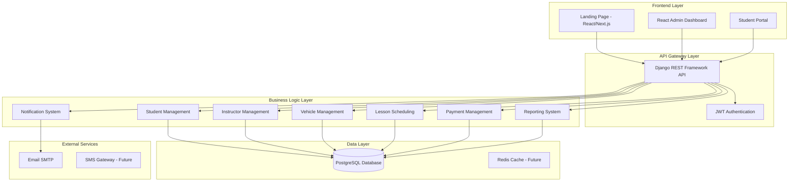
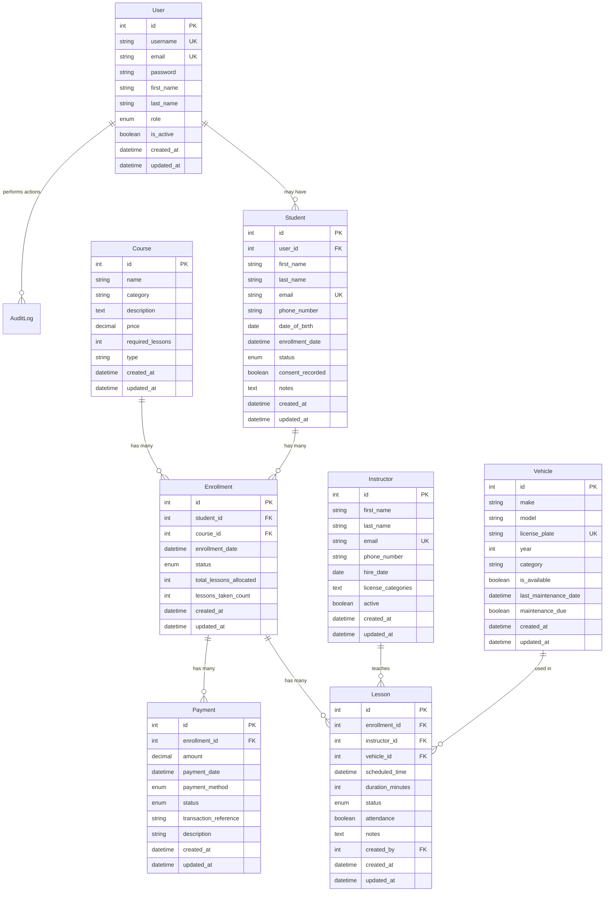

# Design Document

## Overview

The Driving School Management System is designed as a modern web application using a microservices-oriented architecture with a Django REST Framework backend, React-based frontend components, and PostgreSQL database. The system follows RESTful API principles and implements JWT-based authentication with role-based access control.

The architecture supports the core business workflows of a driving school: student lifecycle management, instructor and vehicle resource allocation, lesson scheduling with conflict resolution, payment processing, and multi-language communication systems.

## Architecture

### System Architecture



### Technology Stack

**Backend:**
- Django 4.2+ with Django REST Framework
- PostgreSQL 14+ for primary data storage
- JWT authentication using djangorestframework-simplejwt
- Django's built-in email system with SMTP configuration
- Docker containerization

**Frontend:**
- React Admin for administrative interface
- React/Next.js for public landing page and student portal
- react-i18next for internationalization
- Axios for API communication

**Infrastructure:**
- Docker Compose for development environment
- PostgreSQL container for database
- Environment-based configuration management

## Components and Interfaces

### API Design

**Base URL Structure:** `/api/v1/`

**Authentication Endpoints:**
```
POST /api/token/ - Obtain JWT token pair
POST /api/token/refresh/ - Refresh access token
POST /api/token/verify/ - Verify token validity
```

**Core Resource Endpoints:**
```
/api/students/ - Student management (CRUD + search)
/api/students/register/ - Public registration endpoint
/api/instructors/ - Instructor management (CRUD)
/api/vehicles/ - Vehicle management (CRUD)
/api/courses/ - Course catalog management
/api/enrollments/ - Student-course enrollment relationships
/api/lessons/ - Lesson scheduling and management
/api/payments/ - Payment tracking and processing
/api/reports/ - Analytics and reporting endpoints
/api/notifications/ - Notification management
```

### Core Components

#### 1. Student Management Component

**Responsibilities:**
- Handle student registration and profile management
- Manage student status transitions
- Provide search and filtering capabilities
- Maintain GDPR compliance records

**Key Classes:**
- `StudentViewSet` - DRF ViewSet for CRUD operations
- `StudentRegistrationView` - Public registration endpoint
- `StudentSerializer` - Data serialization and validation
- `Student` model - Core student data model

#### 2. Lesson Scheduling Component

**Responsibilities:**
- Schedule theory and practical lessons
- Detect and prevent scheduling conflicts
- Manage lesson attendance and completion
- Coordinate instructor and vehicle assignments

**Key Classes:**
- `LessonViewSet` - Lesson CRUD and scheduling logic
- `ConflictDetectionService` - Business logic for conflict checking
- `LessonSerializer` - Lesson data validation
- `Lesson` model - Lesson data structure

**Conflict Detection Algorithm:**
```python
def check_scheduling_conflicts(instructor_id, vehicle_id, start_time, duration):
    end_time = start_time + timedelta(minutes=duration)
    
    # Check instructor conflicts
    instructor_conflicts = Lesson.objects.filter(
        instructor_id=instructor_id,
        scheduled_time__lt=end_time,
        scheduled_time__gte=start_time - F('duration_minutes') * timedelta(minutes=1)
    ).exists()
    
    # Check vehicle conflicts (if vehicle assigned)
    vehicle_conflicts = False
    if vehicle_id:
        vehicle_conflicts = Lesson.objects.filter(
            vehicle_id=vehicle_id,
            scheduled_time__lt=end_time,
            scheduled_time__gte=start_time - F('duration_minutes') * timedelta(minutes=1)
        ).exists()
    
    return instructor_conflicts or vehicle_conflicts
```

#### 3. Authentication and Authorization Component

**Responsibilities:**
- Manage user authentication using JWT tokens
- Implement role-based access control
- Handle token refresh and validation
- Secure API endpoints based on user roles

**Permission Classes:**
```python
class RoleBasedPermission(BasePermission):
    def has_permission(self, request, view):
        if not request.user.is_authenticated:
            return False
        
        required_roles = getattr(view, 'required_roles', [])
        return request.user.role in required_roles
```

#### 4. Notification System Component

**Responsibilities:**
- Send email notifications for key events
- Manage notification templates with i18n support
- Queue and track notification delivery status
- Handle SMTP configuration and error handling

**Key Classes:**
- `NotificationService` - Core notification logic
- `EmailTemplate` - Template management with i18n
- `NotificationQueue` - Async notification processing

## Data Models

### Core Entity Relationships



### Database Indexes and Constraints

**Critical Indexes:**
```sql
-- Performance indexes for common queries
CREATE INDEX idx_lessons_instructor_time ON lessons (instructor_id, scheduled_time);
CREATE INDEX idx_lessons_vehicle_time ON lessons (vehicle_id, scheduled_time);
CREATE INDEX idx_students_email ON students (email);
CREATE INDEX idx_students_status ON students (status);
CREATE INDEX idx_enrollments_student ON enrollments (student_id);
CREATE INDEX idx_payments_enrollment ON payments (enrollment_id);

-- Unique constraints
ALTER TABLE students ADD CONSTRAINT uk_students_email UNIQUE (email);
ALTER TABLE instructors ADD CONSTRAINT uk_instructors_email UNIQUE (email);
ALTER TABLE vehicles ADD CONSTRAINT uk_vehicles_license_plate UNIQUE (license_plate);
ALTER TABLE enrollments ADD CONSTRAINT uk_enrollment_student_course UNIQUE (student_id, course_id);
```

## Error Handling

### API Error Response Format

```json
{
  "error": {
    "code": "VALIDATION_ERROR",
    "message": "Invalid input data",
    "details": {
      "field_name": ["Specific error message"]
    },
    "timestamp": "2025-09-15T10:30:00Z"
  }
}
```

### Error Categories

**1. Validation Errors (400)**
- Invalid input data format
- Missing required fields
- Business rule violations

**2. Authentication Errors (401)**
- Invalid or expired JWT tokens
- Missing authentication credentials

**3. Authorization Errors (403)**
- Insufficient permissions for requested action
- Role-based access violations

**4. Resource Errors (404)**
- Requested resource not found
- Invalid resource identifiers

**5. Conflict Errors (409)**
- Scheduling conflicts for instructors/vehicles
- Duplicate resource creation attempts

**6. Server Errors (500)**
- Database connection failures
- External service unavailability
- Unexpected system errors

### Conflict Detection Error Handling

```python
class SchedulingConflictError(ValidationError):
    def __init__(self, conflict_type, resource_id, time_slot):
        message = f"{conflict_type} conflict detected for {resource_id} at {time_slot}"
        super().__init__({"scheduling": [message]})

def validate_lesson_scheduling(data):
    conflicts = check_scheduling_conflicts(
        data['instructor_id'],
        data.get('vehicle_id'),
        data['scheduled_time'],
        data['duration_minutes']
    )
    
    if conflicts:
        raise SchedulingConflictError(
            conflicts['type'],
            conflicts['resource_id'],
            data['scheduled_time']
        )
```

## Testing Strategy

### Testing Pyramid

**1. Unit Tests (70%)**
- Model validation and business logic
- Serializer validation
- Service layer functions
- Utility functions and helpers

**2. Integration Tests (20%)**
- API endpoint functionality
- Database interactions
- Authentication and authorization
- Cross-component interactions

**3. End-to-End Tests (10%)**
- Complete user workflows
- Frontend-backend integration
- Critical business processes

### Key Test Scenarios

**Student Registration Flow:**
```python
def test_student_registration_workflow():
    # Test public registration endpoint
    response = client.post('/api/students/register/', {
        'first_name': 'Ana',
        'last_name': 'Pop',
        'email': 'ana@example.com',
        'phone_number': '+37360123456',
        'date_of_birth': '1998-02-10',
        'course_id': 1,
        'consent': True
    })
    
    assert response.status_code == 201
    assert response.data['status'] == 'PENDING'
    
    # Verify email notification sent
    assert len(mail.outbox) == 1
    assert 'confirmation' in mail.outbox[0].subject.lower()
```

**Lesson Scheduling Conflict Detection:**
```python
def test_lesson_scheduling_conflicts():
    # Create initial lesson
    lesson1 = create_lesson(
        instructor_id=1,
        vehicle_id=1,
        start_time='2025-09-15T10:00:00Z',
        duration=60
    )
    
    # Attempt conflicting lesson
    response = client.post('/api/lessons/', {
        'enrollment_id': 2,
        'instructor_id': 1,
        'vehicle_id': 2,
        'scheduled_time': '2025-09-15T10:30:00Z',
        'duration_minutes': 60
    })
    
    assert response.status_code == 409
    assert 'instructor conflict' in response.data['error']['message'].lower()
```

### Performance Testing

**Database Query Optimization:**
- Monitor N+1 query problems using Django Debug Toolbar
- Implement select_related() and prefetch_related() for complex queries
- Use database connection pooling for production

**API Response Time Targets:**
- Student registration: < 500ms
- Lesson scheduling: < 300ms
- Search operations: < 200ms
- Report generation: < 2s

### Security Testing

**Authentication Security:**
- JWT token expiration and refresh mechanisms
- Password strength validation
- Rate limiting for authentication endpoints

**Authorization Testing:**
- Role-based access control validation
- Data isolation between different user roles
- API endpoint permission verification

**Data Protection:**
- GDPR compliance validation
- Audit log completeness
- Data export and deletion functionality

### Internationalization Testing

**Multi-language Support:**
- Template rendering in all supported languages (EN/RO/RU)
- Email notification localization
- Frontend language switching functionality
- Character encoding support for Cyrillic text

This comprehensive design provides a solid foundation for implementing the Driving School Management System with proper separation of concerns, scalable architecture, and robust error handling mechanisms.